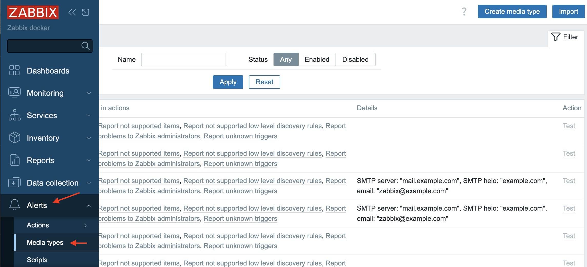
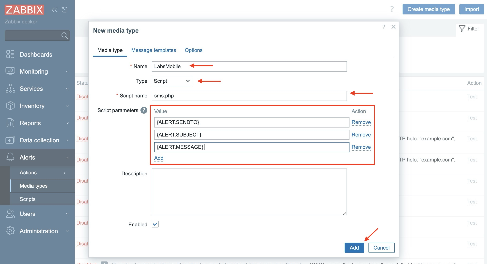
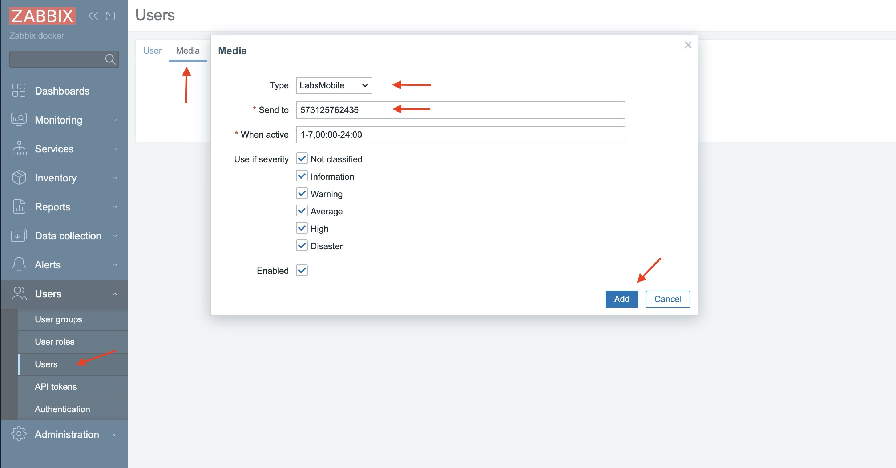
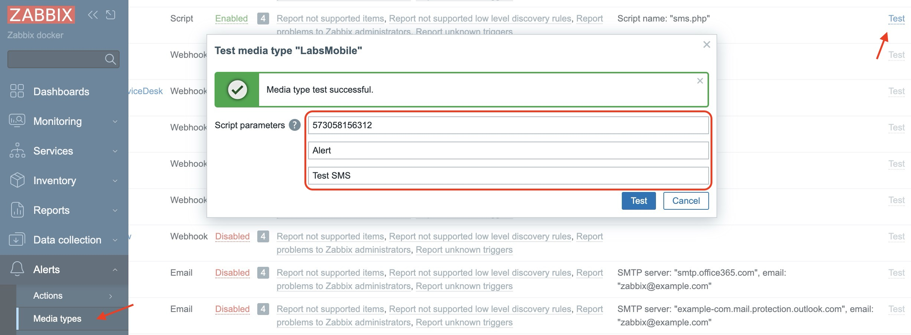
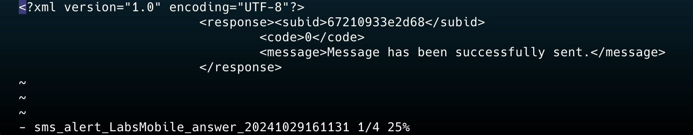

<p align="center">
  
</p>

# LabsMobile-Zabbix


Send SMS notifications through the LabsMobile platform from the Zabbix application. Configure your open source instance of Zabbix so that you can send alerts and notifications via SMS with LabsMobile.

## Documentation

Labsmobile API documentation can be found [here][apidocs].

## Functionalities

* Sending alerts.

## Requirements

- Zabbix app installed and working. More information in [zabbix.com][zabbix].
- A user account with LabsMobile. Click on the link to create an account [here][signUp].

## Authentication

In the integration with Zabbix the authentication is performed with two parameters:

* The **username** of the account to be entered in the **username** field.
* The **tokenapi** to be assigned in the **password** field. This tokenapi can be generated from the [API Settings](https://websms.labsmobile.com/SY0204/api) section of your account.

## Installation

1. Download the LabsMobile SMS module for Zabbix in a .zip file or clone our GitHub repository.
2. Copy all files to the AlertScripts directory of your Zabbix instance. The directory path is `/usr/lib/zabbix/alertscripts.`
3. Configure the permissions and the owner of the files and directories.

```php
chown -R zabbix:zabbix /usr/lib/zabbix/alertscripts
chown -R zabbix:zabbix /var/log/zabbix-server/sms/
chmod 755 /usr/lib/zabbix/alertscripts/sms.php

```

4. Specify the LabsMobile credentials `username:tokenapi` in the config.php file located in the `/usr/lib/zabbix/alertscripts` path. You can also indicate the sender of your choice.

```php
define('GATEWAY_TYPE', 'LabsMobile');
define('GATEWAY_PARAMS', [
    'username' => 'myUsername',
    'password' => 'myToken',
    'sender' => 'Zabbix',
]);

```

5. In Zabbix, go to *Administration > Media Types* or *Alerts > Media Types*, depending on the version you are using.
   
6. Create a new Media Type, indicating the name of the script, the type as script and in Script name enter sms.php. Finally, add the following parameters: `{ALERT.SENDTO}`, `{ALERT.SUBJECT}`, `{ALERT.MESSAGE}` and click Add.
   
7. In Zabbix, go to*Administration > Users*, edit a user that has a mobile number associated with it and assign the user to the script created, indicating the script name and mobile number.
   
8. Test the script from the Zabbix dashboard in the *Administration > Media* Types or *Alerts > Media Types* option. Find the name of the script, click on the Test option and specify all the script parameters.
   
9. You can also test from the terminal.

```text
su -l zabbix -s /bin/bash
cd /usr/lib/zabbix/alertscripts
./sms.php 31123451234 "test" "this is a test"

```

10. You can check the SMS sent in the */var/log/zabbix-server/sms/* directory.
    

## Help

If you have questions, you can contact us through the support chat or through the support email support@labsmobile.com.

[apidocs]: https://www.labsmobile.com/en/api-sms/api-versions/http-get
[signUp]: https://www.labsmobile.com/en/signup
[zabbix]: https://www.zabbix.com/
