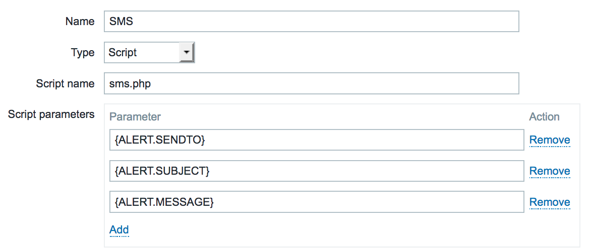

<p align="center">
  
</p>

# LabsMobile-Zabbix


 
Send SMS notifications through the LabsMobile platform from the Zabbix application. Configure your open source instance of Zabbix so that you can send alerts and notifications via SMS with LabsMobile.

## Documentation

Labsmobile API documentation can be found [here][apidocs].

## Features
  - Send SMS messages.

## Requirements

- Zabbix app installed and working. More information in [zabbix.com][zabbix].
- A user account with LabsMobile. Click on the link to create an account [here][signUp].

## Installation

1. Download the LabsMobile SMS Module for Zabbix in .zip file.

2. Move all file to your Zabbix AlertScripts path

3. Set permissions and ownership
```php
chown -R zabbix:zabbix /usr/lib/zabbix/alertscripts
chown -R zabbix:zabbix /var/log/zabbix-server/sms/
chmod 755 /usr/lib/zabbix/alertscripts/sms.php

```
4. copy `config.php.dist` to `config.php`, edit and uncomment the provider of your choice

5. In Zabbix admin go to Administration > Media Types add new media of type `Script` with script name `sms.php` with the following parameters
     - `{ALERT.SENDTO}`
     - `{ALERT.SUBJECT}`
     - `{ALERT.MESSAGE}`



6. In Zabbix GUI, go to Administration > Users, edit a user, make sure it has a mobile phone number and assign the new SMS media.

7. Test the message from cli
```php
su -l zabbix -s /bin/bash
cd /usr/lib/zabbix/alertscripts
./sms.php 31123451234 "test" "this is a test"
```

## Help

If you have questions, you can contact us through the support chat or through the support email support@labsmobile.com.

[apidocs]: https://www.labsmobile.com/en/api-sms/api-versions/http-get
[signUp]: https://www.labsmobile.com/en/signup
[zabbix]:https://www.zabbix.com/

